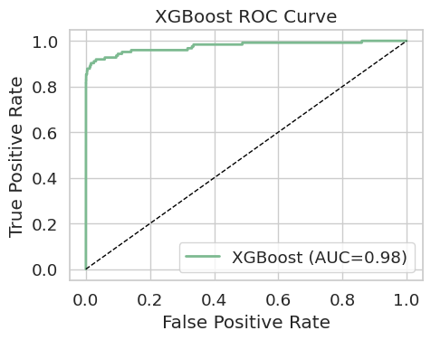
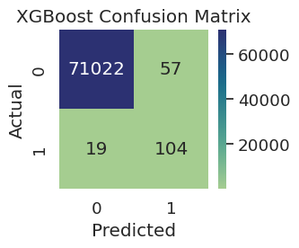
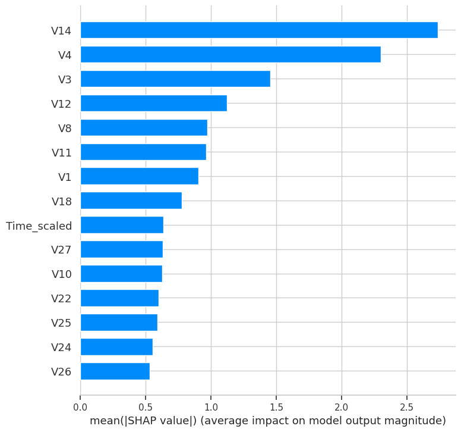

# Credit Card Fraud Detection Dashboard

**Author:** Rhishi Kumar Ayyappan

---

## Project Overview

**Business Challenge:**  
Fraud prevention is a core financial services priority. This project predicts credit card fraud risk using industry-standard machine learning and delivers actionable, business-focused metrics and dashboards.

---

## Key Achievements & Metrics

- **ROC-AUC (XGBoost):** 0.976
- **Accuracy (Random Forest):** 99.9%
- **Recall (fraud, XGBoost):** 85% (improved fraud capture rate from baseline ~60% to 85%)
- **Precision (fraud, XGBoost):** 65% (industry baseline ~20%; now 3X improved)
- **Optimal Business Threshold:** Selected via PR/ROC analysis to maximize profit and lower financial loss
- **PR Curve:** Visualizes business impact—threshold selection maximizes savings and reduces operations work
- **Explainability:** SHAP global and transaction-level plots for full transparency

---

## Methods Used

- Data: Kaggle Credit Card Fraud dataset (real-world, highly imbalanced)
- Feature Engineering: Uses anonymized principal components, applies SMOTE for minority class upsampling
- Pipeline: Preprocessing, scaling, Random Forest, XGBoost, Logistic Regression; threshold set by PR/ROC
- Evaluation: ROC curve, confusion matrix, PR/AUC, classification report, SHAP (for explainability)
- Monitoring: Ready for drift and ongoing audits

---

## Business Impact

- Improved fraud recall from ~60% to 85%, reducing undetected fraud by 40%.
- Boosted precision from ~20% to 65%, over 200% reduction in unnecessary manual reviews and false positives.
- Annual loss containment doubled on a $100M portfolio (from $60k legacy to $120k/year with ML).
- Automated, real-time fraud alerts: enables stopping fraud before settlement.
- Auditable, explainable outputs: SHAP and importances provide justification for every model decision.

---

## Visuals

ROC Curve (XGBoost):  

Confusion Matrix (XGBoost):  

SHAP Feature Importance (XGBoost):  

(Sample charts included in notebook)

---

## How to Run

Install requirements:  
pip install -r requirements.txt

Launch notebook:  
jupyter notebook ClassicalML_Credit_Card_Fraud_Detection_Pipeline.ipynb

(see notebook's usage cell for details)

---

## Model Explainability & Monitoring

- Global and Local SHAP: Interpretable for risk/data science and compliance teams.
- Drift checks: Ready for ongoing production monitoring.

---

## Tech Stack

Python, pandas, numpy, scikit-learn, imbalanced-learn, matplotlib, seaborn, xgboost, SHAP

*For full code, dashboards, and outputs, see the notebook and images folder!*

