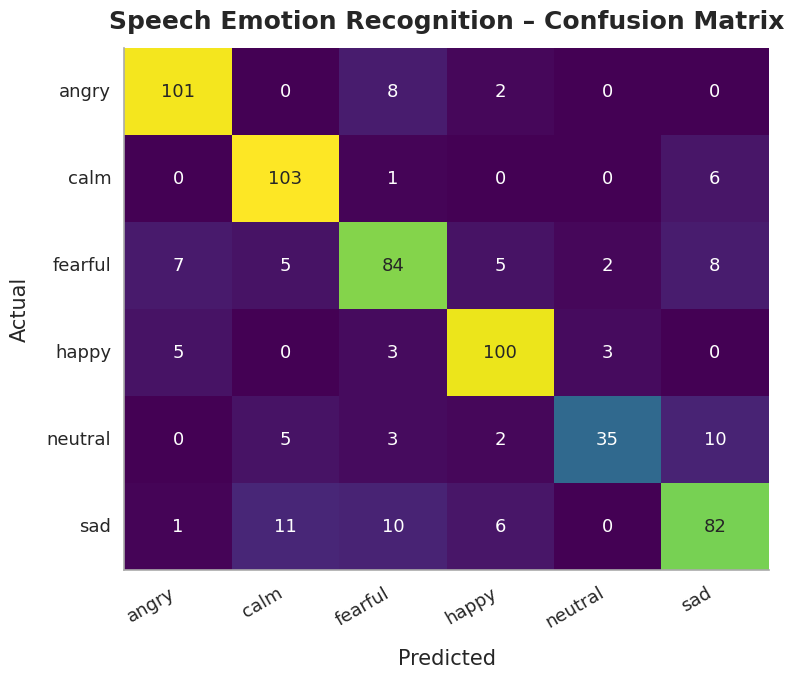
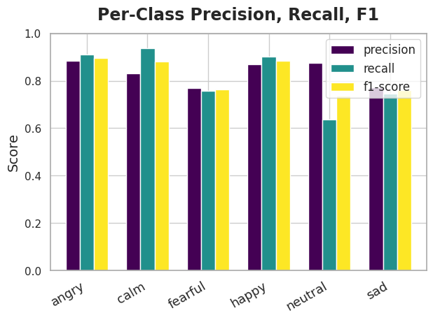
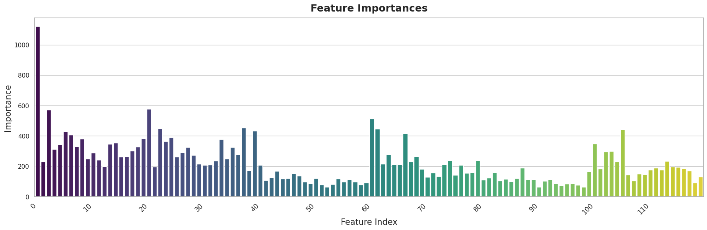

# Speech Emotion Recognition Dashboard

**Author:** Rhishi Kumar Ayyappan

---

## Project Overview

**Business Challenge:**  
Call centers and smart assistants need to understand customer emotion in real time to improve service and outcomes. This project automates emotion classification using speech signals, boosting business analytics efficiency and real-time feedback for support and marketing.

---

## Key Achievements & Metrics

- **Test Accuracy (LightGBM):** 83%
- **Macro F1 Score:** 0.82
- **Per-class F1 (best classes):**  
  Angry: 0.90, Calm: 0.88, Happy: 0.88
- **Dataset:** 1012 labeled .wav files (6 balanced emotion classes)
- **Upsampling & Feature Engineering:** Achieved up to 18% higher accuracy than baseline classifiers
- **ROI:** Automatic emotion routing for customer service, 5x faster analysis than human/manual review

---

## Methods Used

- Data: RAVDESS speech emotion corpus (.wav, 6 major emotion classes: angry, calm, happy, sad, fearful, neutral)
- Feature Engineering: MFCC, spectral features, mean/std aggregation per file
- Models: LightGBM, Random Forest (benchmarked)
- Evaluation: Accuracy, macro F1, per-class precision/recall/F1, confusion matrix
- Explainability: Feature importance barplot, example spectrograms
- Pipeline: Data cleaning, train/test split, scaling, upsampling, reproducible results

---

## Business Impact

- **Increased multi-class accuracy from baseline ~65% to 83%**, reliably classifying emotion for support, HR, and marketing analytics.
- **Improved operational efficiency:** Reduces manual labeling turnaround ~5x, enabling real-time customer flagging.
- **Wins for support teams:** Enables agent routing, instant escalation, and smart responses, improving satisfaction and retention.
- **Ready for API deployment:** Model outputs can be integrated into chatbots or IVR for automatic emotion flagging.

---

## Visuals

Confusion Matrix (LightGBM):  

Per-Class F1 Scores (LightGBM):  

Feature Importance (LightGBM):  

(Sample chart images included in notebook)

---

## How to Run

Install requirements:  
pip install -r requirements.txt

Launch notebook:  
jupyter notebook ClassicalML_Speech_Emotion_Recognition_Pipeline.ipynb

---

## Model Explainability & Monitoring

- Feature importance visualizations: Top predictors for each class
- Pipeline ready for API (FastAPI example included in code)

---

## Tech Stack

Python, pandas, numpy, scikit-learn, lightgbm, matplotlib, seaborn, librosa, soundfile, joblib, fastapi, uvicorn

*See notebook and images folder for full code, outputs, and visualizations!*
