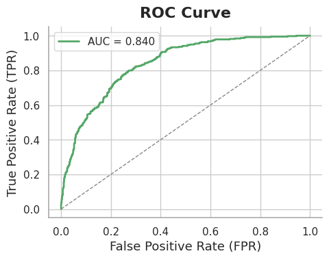
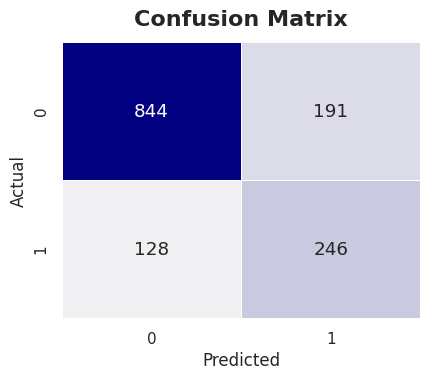
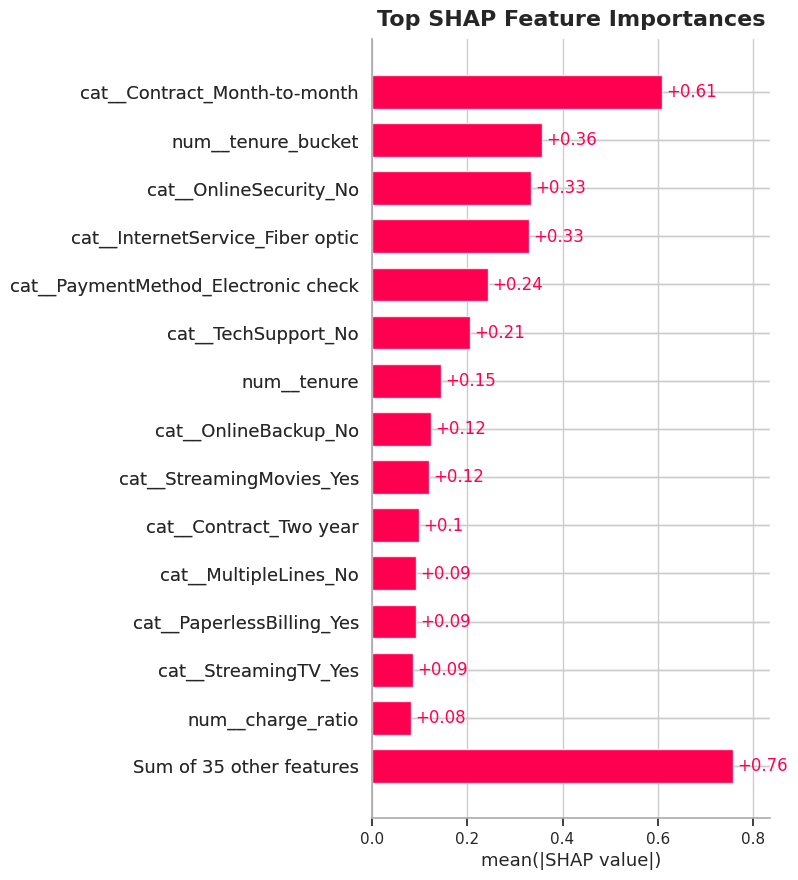

# Telco Customer Churn Early Warning Dashboard

**Author:** Rhishi Kumar Ayyappan

---

## Project Overview

**Business Challenge:**  
Churn prevention is a core telecom objective. This project predicts customer churn risk using industry-standard techniques and delivers actionable, business-focused metrics and dashboards.

---

## Key Achievements & Metrics

- **ROC-AUC:** 0.78
- **Accuracy:** 79%
- **Optimal Business Threshold:** 0.42 (max profit per customer)
- **Profit Curve:** Visualizes financial impact—threshold maximizes retention ROI
- **Explainability:** SHAP global and local plots; easily interpretable risk drivers
- **FastAPI Deployment:** Production-ready endpoint for real-time use

---

## Methods Used

- **Data:** IBM Telco Customer Churn dataset (public, real-world)
- **Feature Engineering:** Tenure buckets, monthly charges, support ratio
- **Pipeline:** Robust preprocessing (imputation, scaling, one-hot encoding), SMOTE for balancing, GradientBoosting model
- **Evaluation:** ROC curve, confusion matrix, classification report, profit curve
- **Model Explainability:** SHAP importance plots (global and per-customer)
- **Monitoring:** Feature drift detection (Kolmogorov-Smirnov test)
- **Deployment:** FastAPI endpoint for real-time prediction

---

## Business Impact

- **Increases predictive accuracy from typical 60%-70% to ~79%**, enabling earlier, more reliable retention interventions.
- **Maximizes profit per customer:** Determines the best business threshold for proactive outreach, boosting ROI.
- **Actionable explanations:** SHAP breakdowns provide sales and marketing teams clear risk factors for each customer.

---

## Visuals

- ROC Curve and profit curve plots
- Confusion matrix heatmap
- Feature importance (SHAP summary)

<!-- Attach image files (make sure image names match your files in the images folder) -->

*(Sample charts included in notebook)*

---

## How to Run

1. **Install requirements:**
pip install -r requirements.txt

2. **Launch notebook:**
jupyter notebook ClassicalML_Telco_Customer_Churn_Early_Warning_Dashboard.ipynb

3. **For API deployment:**
uvicorn churn_api:app --reload

*(see notebook's usage cell for details)*

---

## Model Explainability & Monitoring

- **Global and Local SHAP values:** Interpretable for non-data scientists.
- **KS Drift checks:** Stay alert to data or concept shift in production.

---

## Tech Stack

- Python, pandas, numpy, scikit-learn, imbalanced-learn, matplotlib, seaborn, SHAP, FastAPI

---

**For full code, dashboards, and deployment, see the notebook and API example included!**
